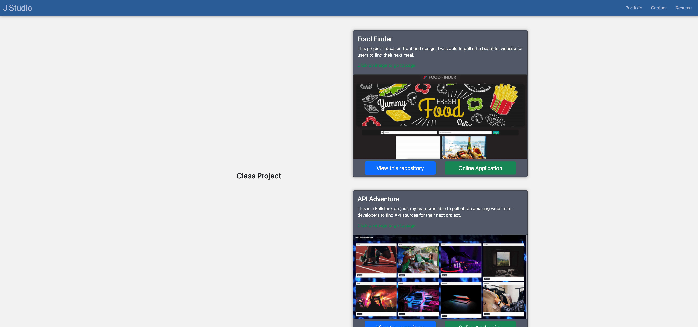

# JStudio-React

#### Resources

[Github Repository](https://github.com/Truecoding4life/JStudio-React)

#### Table of contents
* [Description](#description)
* [Installation](#installation)
* [Usage](#usage)
* [Technologies used](#technologies-used)

## Description
**Simplicity:** Jay's Studio embraces a clean and minimalistic design philosophy, ensuring that visitors can easily focus on your content without distractions.

**Easy Navigation:** We've prioritized user-friendliness, making it effortless for your audience to find their way around your website.

### Installation
-  Download the Zip file to your device
- Open file to zip local as needed
- Use your IDE to make update accordingly
- Update your repository and use accordingly

### Usage

#### Navigation Bar ☺︎
This is where you would find most of the content of the webpage with a click on of button. You can navigate through home page, project page and even contact info buy just hover over a button and the button will change it color to greet you 

## Technologies used

---

#### This README was generated based on the Good README Guide

---

This Website is made available by © Jay's Studio 2023